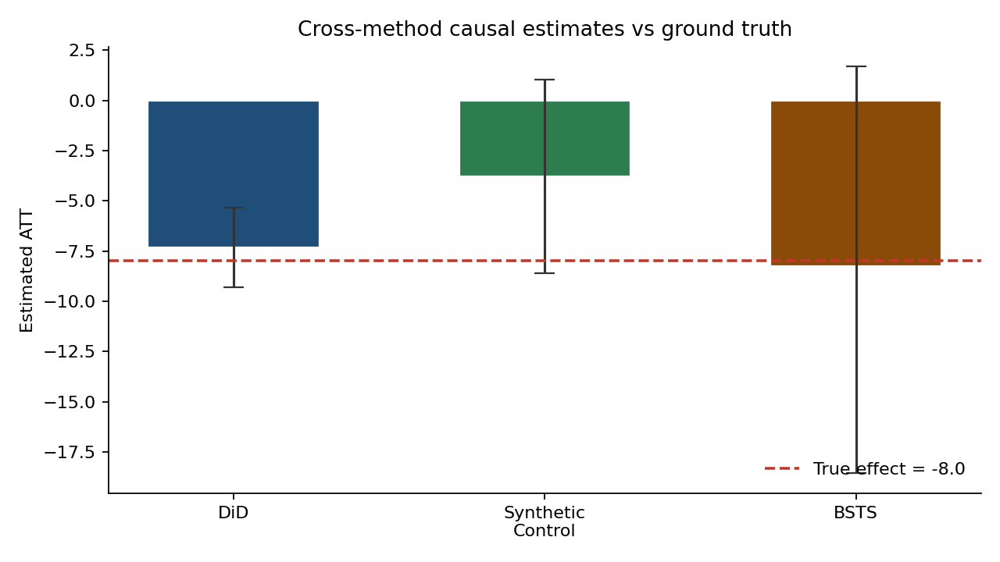
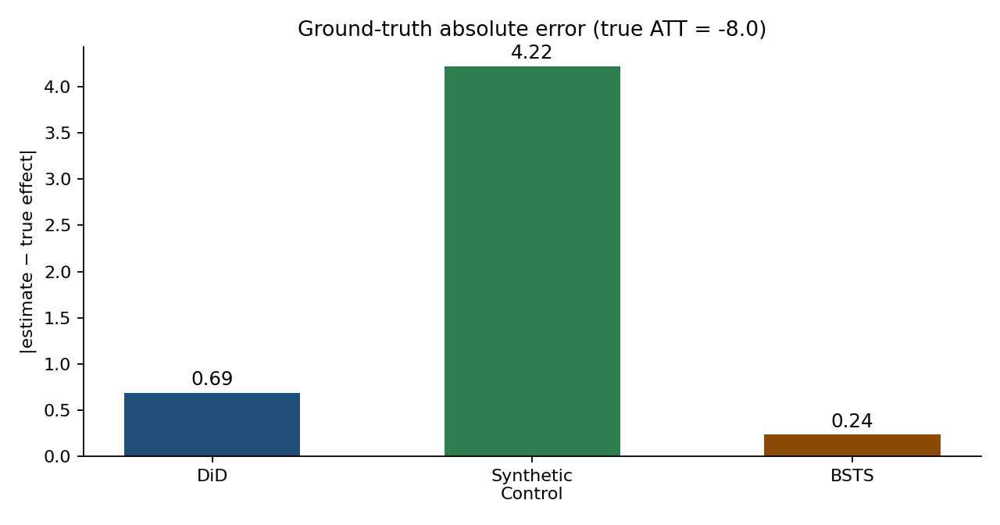
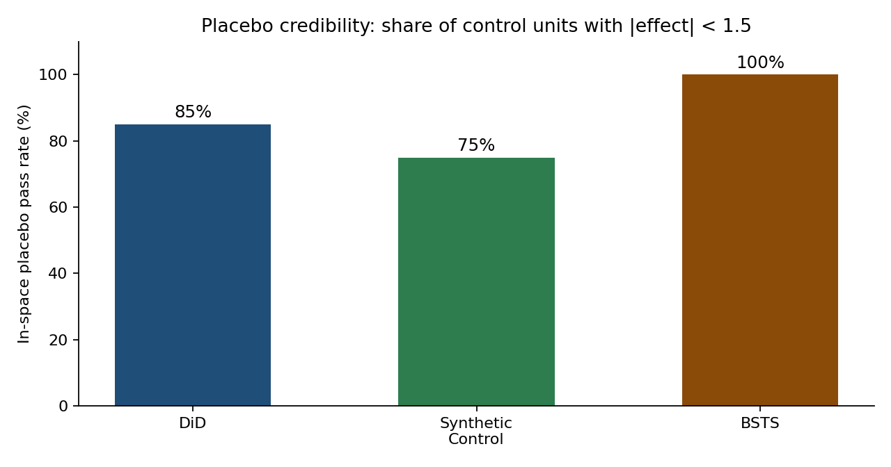
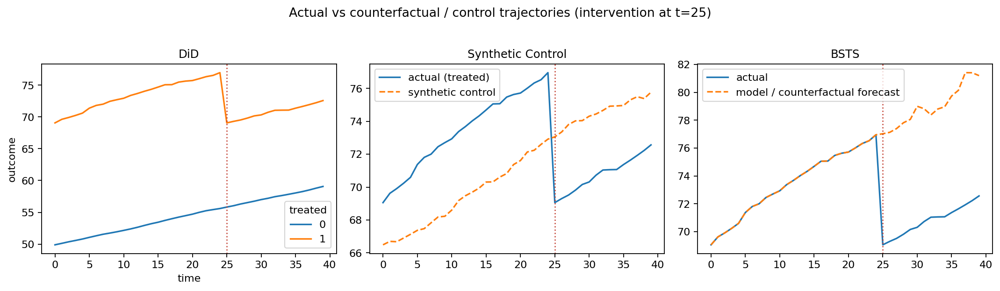
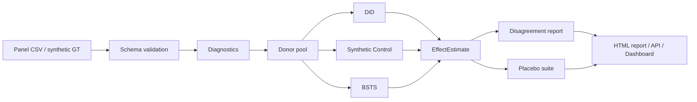
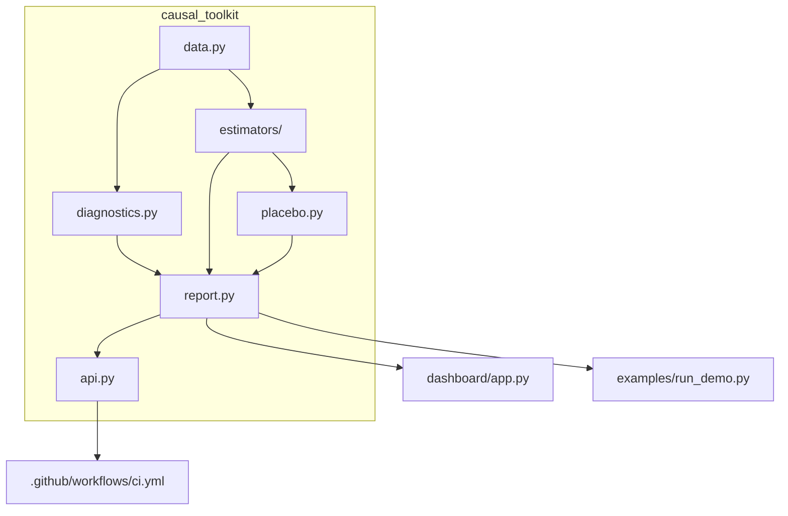
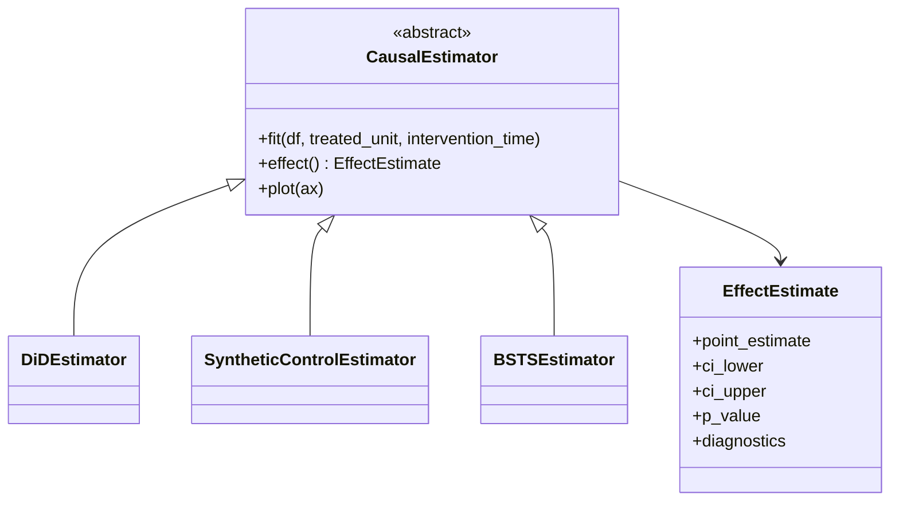

# Causal Inference Toolkit for Product Metrics

[](https://github.com/ArchanaChetan07/Causal-Inference-Toolkit-for-Product-Metrics/actions/workflows/ci.yml)


**Estimate causal impact on observational product data — and prove the estimate is credible.**

A production-oriented Python library that unifies **Difference-in-Differences**, **Synthetic Control**, and **Bayesian Structural Time Series** (CausalImpact-style) behind one estimator API, with pre-period diagnostics, placebo validation, and honest cross-method disagreement reporting.

Built for the questions FAANG product / growth / ads / marketplace science teams ask when A/B tests are unavailable, contaminated, or constrained.

<p align="center">
  
</p>

---

## Results (validated on ground-truth panel)

Synthetic panel: **20 controls + 1 treated unit**, **40 periods**, intervention at **t=25**, documented ATT = **−8.0** (`seed=42`).

Pre-trend diagnostic: **PASS** (interaction coef = 0.076, p = 0.813).

### Cross-method estimates

| Method | Estimate | 95% CI | Abs error vs −8.0 | True effect in CI |
|---|---:|---|---:|:---:|
| Difference-in-Differences | **−7.313** | [−9.293, −5.333] | 0.69 | PASS |
| Synthetic Control | **−3.777** | [−8.596, 1.041] | 4.22 | PASS |
| Bayesian Structural Time Series | **−8.236** | [−18.565, 1.674] | 0.24 | PASS |

**Relative disagreement across methods: 69.2%** — surfaced explicitly instead of averaging incompatible answers.

<p align="center">
  
</p>

### Placebo credibility

| Method | In-time placebo (fake t=12) | In-space pass rate |
|---|---|---:|
| DiD | **PASS** (effect = 0.96) | **85%** |
| Synthetic Control | FAIL (effect = 4.27) | **75%** |
| BSTS | FAIL (effect = −1.70) | **100%** |

Threshold for “pass”: `|effect| < 1.5`. In-space tests drop the truly treated unit so its real shock cannot contaminate controls.

<p align="center">
  
</p>

### Trajectories (actual vs counterfactual)

Intervention marked at **t=25**. DiD shows treated vs control means; Synthetic Control and BSTS show the constructed / forecast counterfactual.

<p align="center">
  
</p>

Regenerate figures anytime:

```bash
python examples/generate_readme_assets.py
```

---

## System design

### End-to-end pipeline



### Component map



### Estimator contract



---

## Why this exists

| Failure mode | Toolkit response |
|---|---|
| Curve-fitting labeled “causal” | Ground-truth backtests with a **known ATT** |
| False positives on noisy panels | **In-time** + **in-space** placebos |
| Cherry-picking the flattering method | DiD + SC + BSTS with **explicit disagreement** |
| Silent assumption breaks | Parallel trends, donor ranking, balance tables |
| Notebook-only science | FastAPI, Streamlit, Docker, CI ≥90% coverage |

---

## 60-second demo

```bash
pip install -e ".[api,dashboard,dev]"
python examples/run_demo.py          # -> reports/comparison_report.html
pytest --cov=causal_toolkit          # CI fails under 90% coverage
```

```python
from causal_toolkit import make_ground_truth_dataset, run_all_methods

gt = make_ground_truth_dataset()  # documented true_effect = -8.0
comp = run_all_methods(
    gt.df,
    treated_unit=gt.treated_unit,
    intervention_time=gt.intervention_time,
    true_effect=gt.true_effect,
)

for name, effect in comp["results"].items():
    print(effect.summary())
```

---

## Methods

| Method | Estimator | Inference | Best when | Honest limitation |
|---|---|---|---|---|
| **DiD** | Classic `treated × post` OLS | HC1 robust SE | Clear groups, parallel trends | Not Callaway–Sant’Anna / full TWFE |
| **Synthetic Control** | Nonnegative weights → 1 | In-space placebo (Abadie) | One treated unit, strong donors | Bias under idiosyncratic noise-walks |
| **BSTS** | Local-level + donors (Kalman) | Forecast-variance CI (approx.) | Rich pre-period series | Not full MCMC posterior |

---

## API, dashboard, Docker

```bash
uvicorn causal_toolkit.api:app --reload
# /docs  /health  /ready  /demo  /demo/report
# POST /estimate | /diagnostics | /placebo-test

streamlit run dashboard/app.py

docker compose up --build
```

Upload limits: **25 MiB** / **500k rows**. API has **no auth** — localhost or reverse-proxy only for non-demo use.

---

## Repository layout

```text
causal_toolkit/     # library: data, diagnostics, estimators, placebo, report, api
dashboard/          # Streamlit UI
examples/           # demo + README asset generator
assets/             # published result figures
tests/              # pytest suite (CI-gated)
```

| Path | Interview signal |
|---|---|
| `estimators/` | Shared abstraction + three real methods |
| `placebo.py` | Credibility engineering, not just point estimates |
| `report.py` | Forces honest multi-method comparison |
| `api.py` + `Dockerfile` | Research code that runs as a service |
| `assets/` + Results section | Reproducible evidence, not marketing claims |

---

## Production checklist (v0.2)

| Area | Status |
|---|---|
| Panel validation + size caps | Done |
| Diagnostics honor `treated_unit` | Done |
| Donors exclude other treated units | Done |
| API 422 mapping, logging, `/ready` | Done |
| CI: ruff + mypy + pytest 3.9–3.12, coverage ≥90% | Done |
| Multi-stage non-root Docker + HEALTHCHECK | Done |

---

## Roadmap

- [ ] Callaway–Sant’Anna staggered DiD
- [ ] Full PyMC / NumPyro MCMC backend for BSTS
- [ ] California Prop 99 public demo panel
- [ ] Generalized synthetic control (multi-treated)
- [ ] PyPI release

## License

MIT — see [LICENSE](LICENSE).

### Author

Portfolio demonstration of **applied causal inference + production Python** for product-metrics and experiment-science roles.
